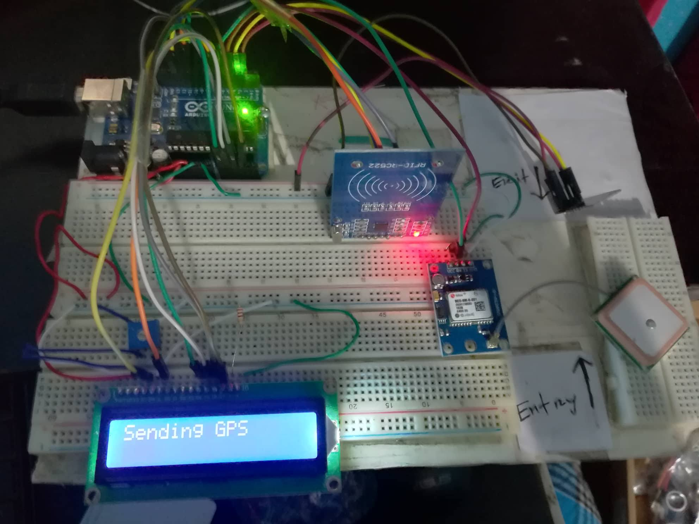
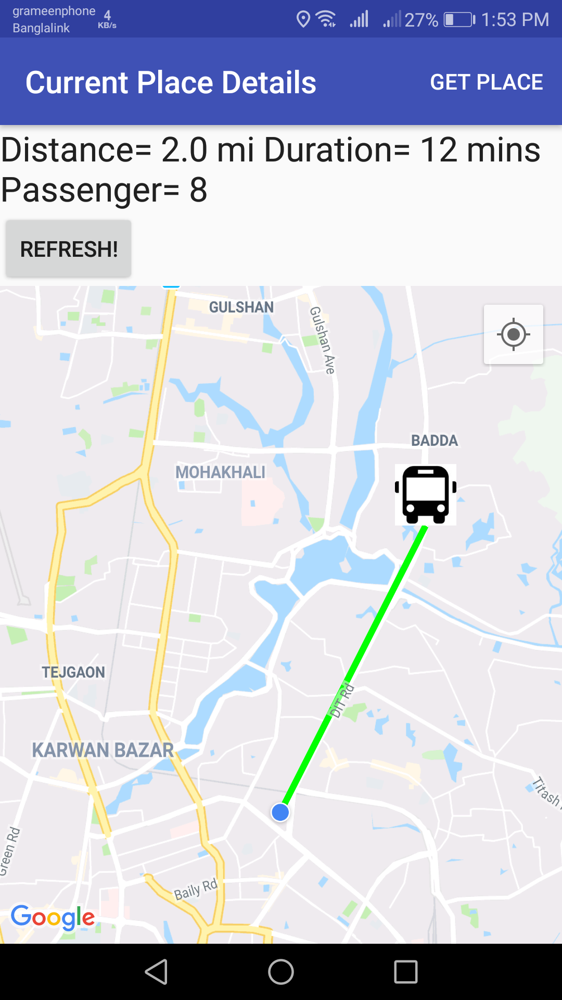

# Bus tracker and RFID Payment System

Small portable arduino based device that can be placed onto any bus. RFID payment and gps are included. Fare are calculated automatically and deducted from RFID. The android app shows realtime info and location of the Bus.

# Device

Components & Sensors:
  - Arduino Uno
  - 16*2 LCD
  - RFID Module (MFRC-522) 
  - GPS Module (Neo6M V2)
  - Wifi Module (ESP8266)

# Android App
Android Screenshot:

 Android Features:
  - Bus Distance
  - Arrival Time
  - Passenger onboard Count
  - Map
 

License
----

# Bus tracker and RFID Payment System

Small portable arduino based device that can be placed onto any bus. RFID payment and gps are included. Fare are calculated automatically and deducted from RFID. The android app shows realtime info and location of the Bus.

# Device

Components & Sensors:
  - Arduino Uno
  - 16*2 LCD
  - RFID Module (MFRC-522) 
  - GPS Module (Neo6M V2)
  - Wifi Module (ESP8266)

# Android App
Android Screenshot:

 Android Features:
  - Bus Distance
  - Arrival Time
  - Passenger list
  - Map
 

License
----

